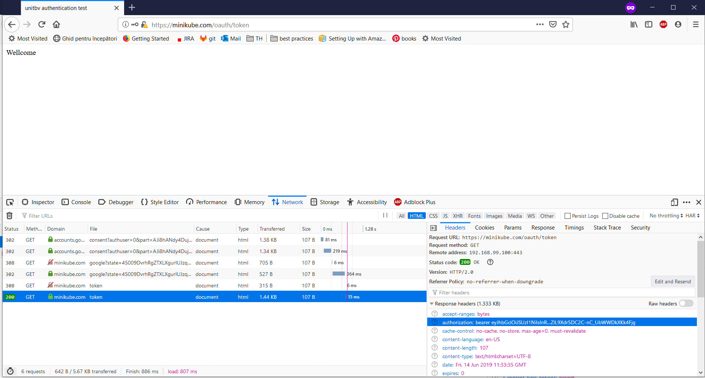
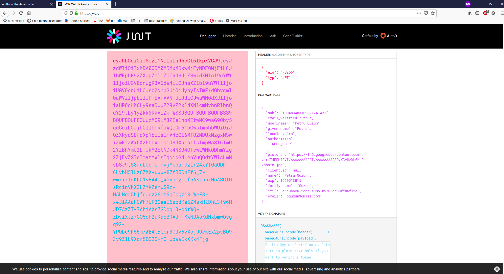
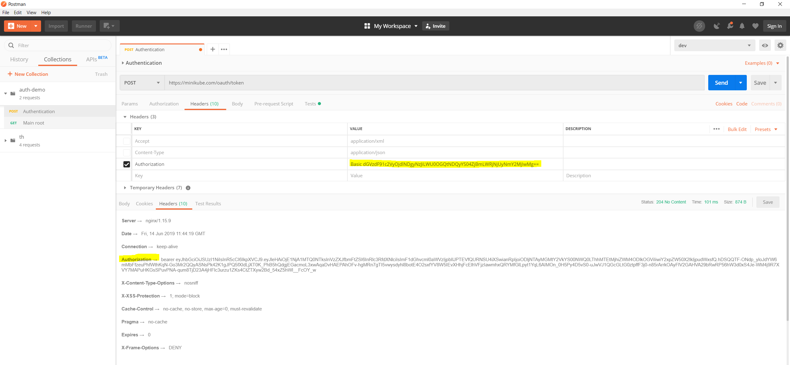
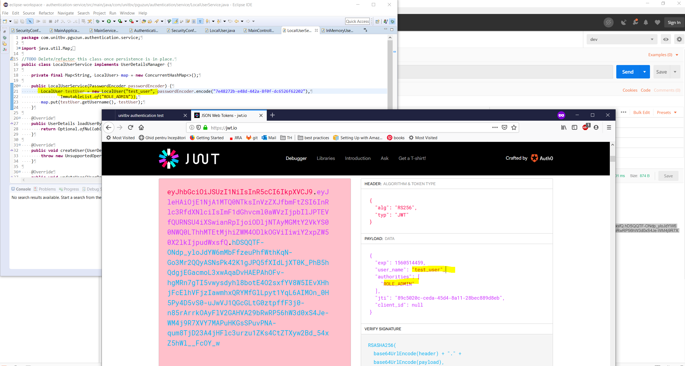
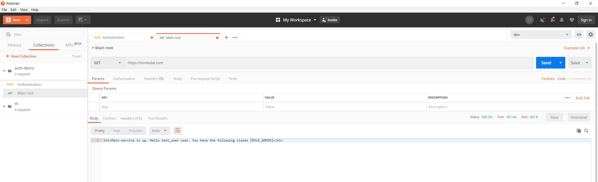
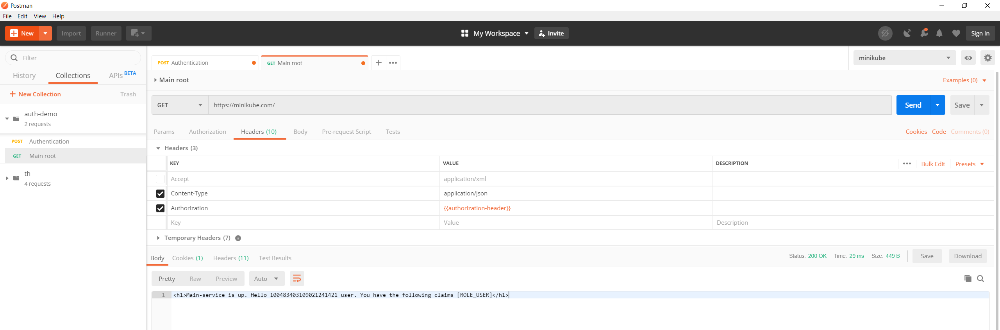
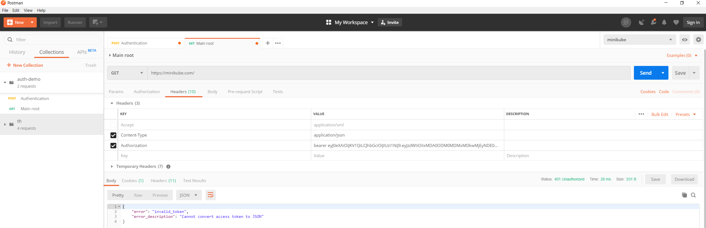

# Requirements
 * java 11
 * docker (docker-cli for windows)
 * virtualbox - only for windows guys
 * minikube kuberntes hypervisor (I dont recomend running docker-for-windows with HyperV )
 * kubectl - Kubernetes control
 * configure docker-cli to use docker in minikube. See 'minikube docker-env'.

# To build and deploy

See Readme files in [authentication-service](authentication-service/Readme.md) and [main-service](main-service/Readme.md).

To deploy authentication:
'kubectl apply -f k8s-resources\authentication-deployment.yaml'

To create authentication-service:
'kubectl apply -f k8s-resources\authentication-service.yaml'

To deploy main:
'kubectl apply -f k8s-resources\main-deployment.yaml'

To create main-service:
'kubectl apply -f k8s-resources\main-service.yaml'

To create ingres:
'kubectl apply -f k8s-resources\ingress.yml'

To find out the deployment ip
'minikube ip'

For accesibility and google authorisation domains register minikube.com in windows hosts as  value of 'minikube ip'

# Observation

With this demo project we have got knowledge about security certificates. I chose sha256 signature algorithm with a RSA 2048 bit key.

# Demo-auth

This project treats a common scenario where in a microservices environement we have  some 'main-service' that needs to be REST consumed securily. 
It can be accessed only using a JWT token authentication.

## Authentication-service

The 'authentication-service' that covers all authentication functionality. It's main purpose is to authenticate users and generate a JWT Token signed to access 'main-service'.
As allways this service needs to be OAuth authentication capable to connect it different services and sure support Basic authentication at least for automated tests.

## Main-service

The 'main-service' is a demo service that can check JWT token for signature (using a copy of public key which must be publicly available) and in-token claims.

## Infrastructure

The services are deployed using kubernetes configuration just for easy demo.

## Screenshots

In this screen we navigate to 'https://minikube.com/oauth/token' in order to obtain login. This redirects automatically to google 'unitbv-test' project that asks for you google credentials. 
All process of flow redirects happens in browser, you can check the traces of calls, and as result 'Authorization' header has the jwt token to be used further from the web application.

In this screen you can see the values encoded in the JWT token.

In this screen I use postman to authenticate with user 'test_user:7e48272b-e48d-442a-8f0f-dc6526f62202'.

This screen shows the values encoded in the JWT TOKEN authentication for user  'test_user'

The result successfull authentication using JWT token obtained through Basic authentication.

The result successfull authentication using JWT token obtained through OAuth authentication.

If we play a little trying to modify the JWT Token payload ,using editor here https://www.jsonwebtoken.io/, the result is 401 Unauthorized.

## Conclusion

By applying all learned tehnologies (cryptography, certificates, OAuth authentication, Basic authentication, JWT Token based authentication) we can build really good secured applications.

# References

* [Java](https://www.java.com/en/download/)
* [Docker](https://stefanscherer.github.io/get-started-with-docker-on-windows-using-chocolatey/#dockerclient)
* [Virtualbox](https://chocolatey.org/packages/virtualbox)
* [Minikube](https://kubernetes.io/docs/tasks/tools/install-minikube/)

You can read on :
* https://oauth.net/2/ about OAuth authentication.
* https://en.wikipedia.org/wiki/Basic_access_authentication about Basic authentication.
* https://jwt.io/introduction/ about JWT Token authentication.

I used https://hohnstaedt.de/xca/ database to generate all certificates and their secret key.